# Implementation of CutPaste

This is an **unofficial** work in progress PyTorch reimplementation of [CutPaste: Self-Supervised Learning for Anomaly Detection and  Localization](https://arxiv.org/abs/2104.04015) and in no way affiliated with the original authors. Use at own risk. Pull requests and feedback is appreciated.

## Setup
Download the MVTec Anomaly detection Dataset from [here](https://www.mvtec.com/company/research/datasets/mvtec-ad) and extract it into a new folder named `Data`.

Install the following requirements:
1. Pytorch and torchvision
2. sklearn
3. pandas
4. seaborn
5. tqdm
6. tensorboard

For example with [Anaconda](https://docs.conda.io/projects/conda/en/latest/user-guide/install/download.html):
```
conda create -n cutpaste pytorch torchvision torchaudio cudatoolkit=10.2 seaborn pandas tqdm tensorboard scikit-learn -c pytorch
conda activate cutpaste
```

## Run Training
```
python run_training.py --model_dir models --head_layer 2
```
The Script will train a model for each defect type and save it in the `model_dir` Folder.

One can track the training progress of the models with tensorboard:
```
tensorboard --logdir logdirs
```

## Run Evaluation
```
python eval.py --model_dir models --head_layer 2
```
This will create a new directory `Eval` with plots for each defect type/model.

# Implementation details

### CutPaste Location
The pasted image patch always origins from the same image it is pasted to. I'm not sure if this is a Problem and if this is also the case in the original paper/code.

### Epochs
Li et al. define "256 parameter update steps" as one epoch. The `--epoch` parameter takes the number of update steps and not their definition of epochs.

### Batch Size
Li et al. use a "batch size of 64 (or 96 for 3-way)". Because the number of images feed into the model changes from the normal to the 3-way variant I suspect that they always start with 32 images that get augmented. The `--batch_size` parameter specifies the number of images read from disk. So for the all variants `--batch_size=32` should correspond with the batch size used by Li et al.

### Projection head
I did not find a model description of the projection head Li et al. use.
The `--head_layer` parameter is used to vary the number of layers used in this implementation.
Actually `head_layer + 2` fully connected layers are used.
Starting with `head_layer` layers with 512 neurons, followed by a layer with 128 neurons and the output layer with 2 or 3 neurons. The number of neurons depends on the variant. 2 for `normal` and `scar` and 3 for `3way`.

### Augmentations used before CutPaste
Li et al. "apply random translation and
color jitters for data augmentation".
This implementation only applies color jitter before the CutPaste augmentation. I tried to use [torchvision.transforms.RandomResizedCrop](https://pytorch.org/vision/stable/transforms.html#torchvision.transforms.RandomResizedCrop) as translation, but in a brief test I did not find that it improves performance.

### Tensorflow vs PyTorch
Li et al. use tensorflow for their implementation. This implementation is using PyTorch.

# Results
This implementation only tries to recreate the main results from section 4.1 and shown in table 1.
## CutPaste
```
python run_training.py --epochs 10000 --test_epochs 32 --no-pretrained --cuda 1 --head_layer 1 --batch_size 32 --variant normal
```
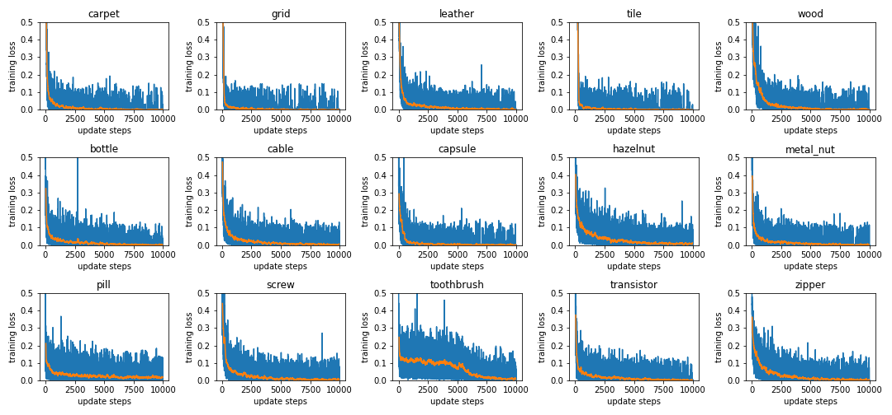
The blue line is the real value and the orange line is an average over 100 epochs.
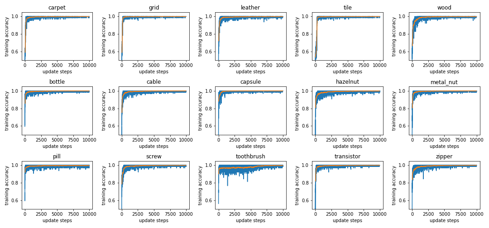
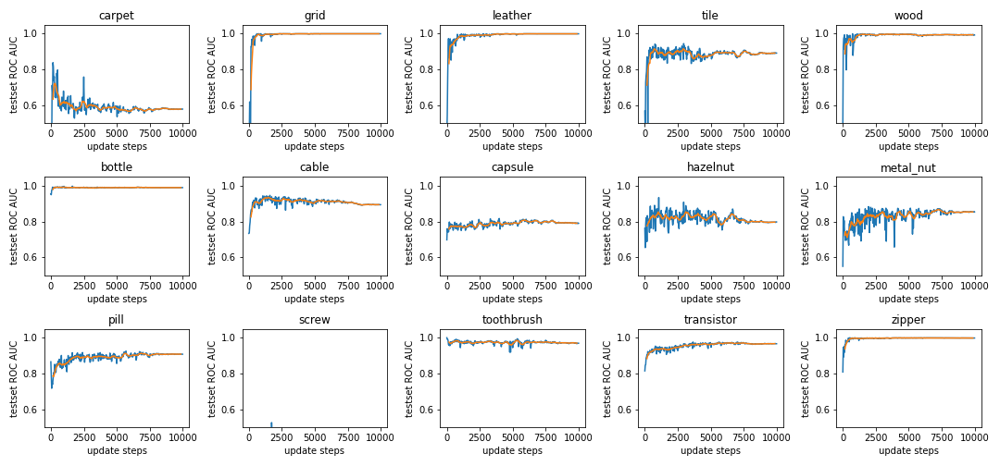
We only run the ROC AUC every 32nd update step, here the orange line is an average over 320 update steps (10 ROC AUC values).
Note: The validation accuracy (named test set ROC AUC) is using the Mahalanobis distance as anomaly score. It can not be directly compared with the accuracy during training.

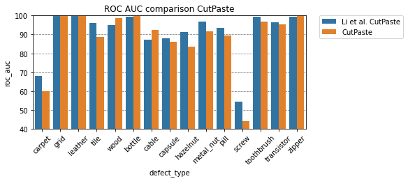

Note that for readability, the y-axis starts at 40% AUC ROC.
## CutPaste (scar)
```
python run_training.py --epochs 10000 --test_epochs 32 --no-pretrained --cuda 1 --head_layer 1 --batch_size 32 --variant scar
```
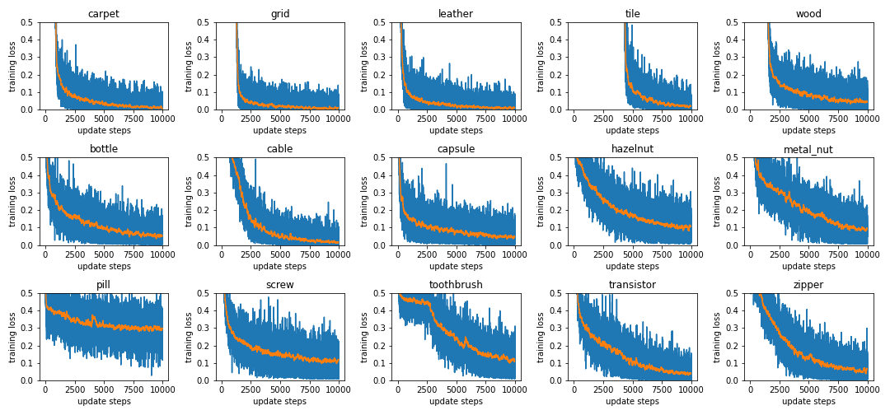
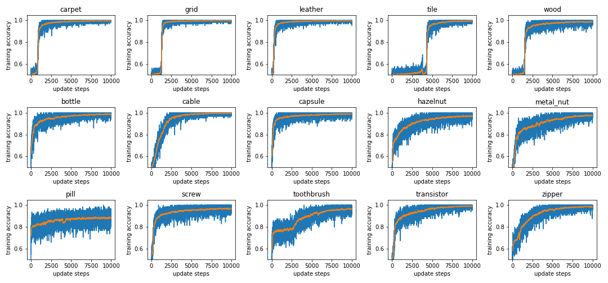
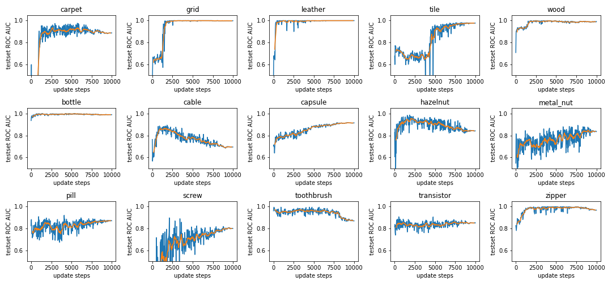

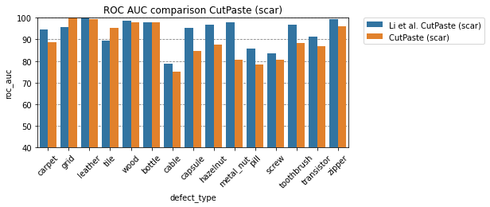
## CutPaste (3-way)
Due to limited computing resources, the evaluation during training is disabled.
```
python run_training.py --epochs 10000 --test_epochs -1 --no-pretrained --cuda 1 --head_layer 1 --batch_size 32 --variant 3way
```
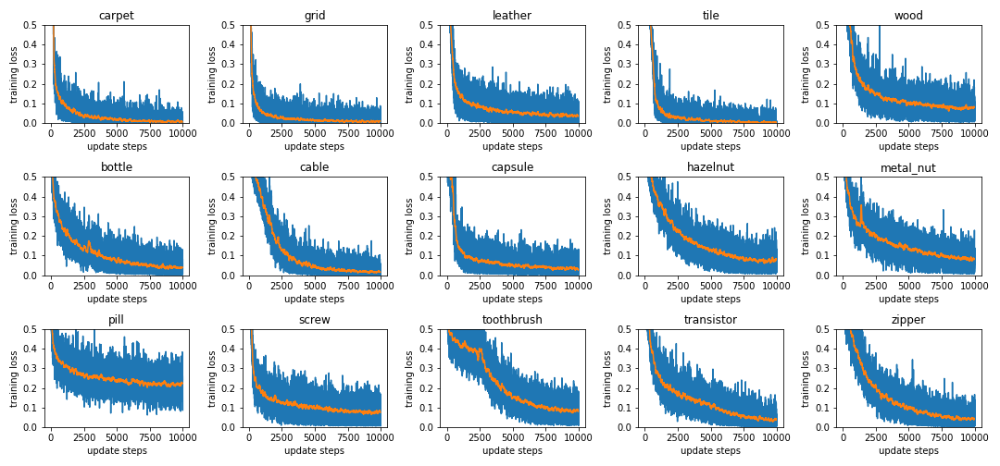
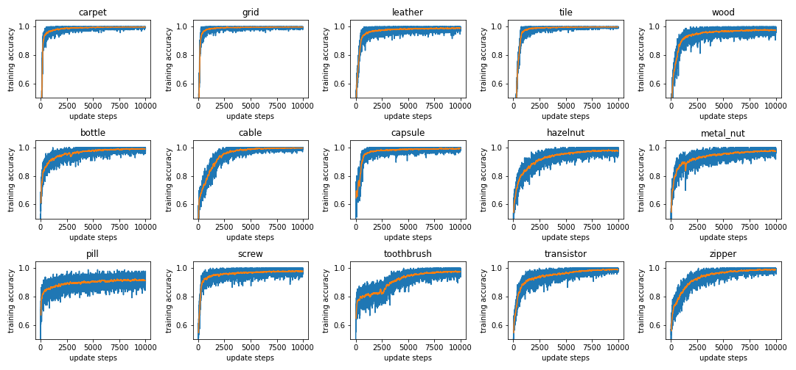
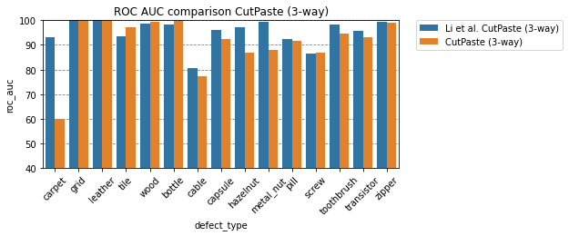

# Comparison to Li et al.
| defect_type   |   CutPaste |   Li et al. CutPaste |   CutPaste (scar) |   Li et al. CutPaste (scar) |   CutPaste (3-way) |   Li et al. CutPaste (3-way) |
|:--------------|-----------:|---------------------:|------------------:|----------------------------:|-------------------:|-----------------------------:|
| bottle        |       99.7 |                 99.2 |              97.9 |                        98.0 |               99.6 |                         98.3 |
| cable         |       92.3 |                 87.1 |              75.0 |                        78.8 |               77.2 |                         80.6 |
| capsule       |       86.2 |                 87.9 |              84.5 |                        95.3 |               92.4 |                         96.2 |
| carpet        |       59.8 |                 67.9 |              88.6 |                        94.6 |               60.1 |                         93.1 |
| grid          |      100.0 |                 99.9 |              99.9 |                        95.5 |              100.0 |                         99.9 |
| hazelnut      |       83.7 |                 91.3 |              87.5 |                        96.7 |               86.8 |                         97.3 |
| leather       |       99.5 |                 99.7 |              99.5 |                       100.0 |              100.0 |                        100.0 |
| metal_nut     |       91.5 |                 96.8 |              80.6 |                        97.9 |               87.8 |                         99.3 |
| pill          |       89.4 |                 93.4 |              78.4 |                        85.8 |               91.7 |                         92.4 |
| screw         |       44.1 |                 54.4 |              80.7 |                        83.7 |               86.8 |                         86.3 |
| tile          |       88.7 |                 95.9 |              95.3 |                        89.4 |               97.2 |                         93.4 |
| toothbrush    |       96.7 |                 99.2 |              88.3 |                        96.7 |               94.7 |                         98.3 |
| transistor    |       95.1 |                 96.4 |              86.8 |                        91.1 |               93.0 |                         95.5 |
| wood          |       98.6 |                 94.9 |              98.0 |                        98.7 |               99.4 |                         98.6 |
| zipper        |       99.6 |                 99.4 |              95.9 |                        99.5 |               98.8 |                         99.4 |
| average       |       88.3 |                 90.9 |              89.1 |                        93.4 |               91.0 |                         95.2 |

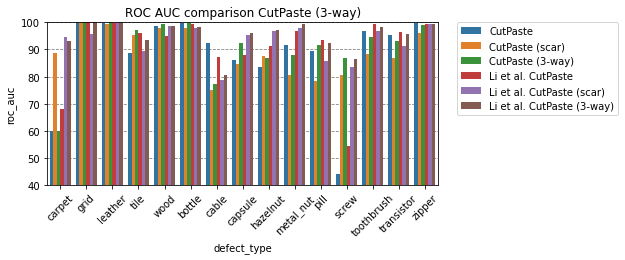
# TODOs
- [x] implement Cut-Paste Scar
- [ ] implement gradCam
- [ ] implement localization variant
- [ ] add option to finetune on EfficientNet(B4)
- [ ] clean up parameters and move them into the arguments of the scripts
- [ ] compare results of this reimplementation with the results of the paper
